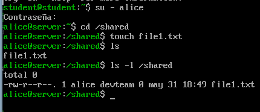
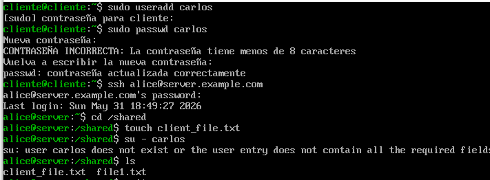

# Users, Groups and Permissions Lab (RHCSA)

## Objective

Practice Linux user and group management and file permission control across a multi-machine environment.

---

## Environment

* Server: server.example.com (192.168.26.10)
* Client: client.example.com (192.168.26.11)

---

## Users Created

```
sudo useradd exampleuser1
sudo passwd exampleuser1
```

### Server

* alice
* bob

### Client

* carlos

---

## Group Configuration

```
sudo groupadd examplegroup
```

* Group: devteam

```
sudo usermod -aG examplegroup exampleuser1
```

* Members: alice, bob

---

## Shared Directory

Path:

```
sudo mkdir /shared
sudo chown root:devteam /shared
```

Permissions:

```
chmod 2770 /shared
```
2 -> setgid (group inheritance),
7 -> rwx for owner, 
7 -> rwx for group, 
0 -> no permissions for others



---

## Key Tests

* Users in devteam can create files in /shared
* Non-members cannot access or write
* Group inheritance works via setgid



---

## Key Learnings

* Linux permissions control access at file and directory level
* Groups simplify multi-user access management
* setgid ensures consistent group ownership in shared directories
* Proper permissions enhance security and collaboration

## Issues

* None